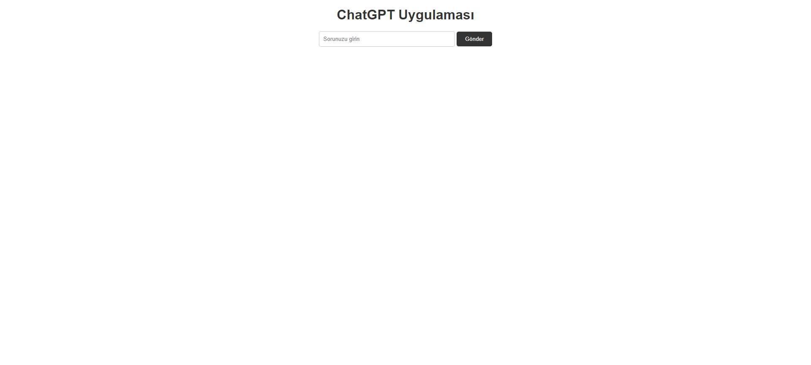

# ChatGPT Uygulaması

Bu Flask uygulaması, kullanıcıların sorularını yanıtlamak için OpenAI'nin ChatGPT modelini kullanan bir web arayüzü sağlar.



## Amaç

ChatGPT Uygulaması, doğal dil işleme yeteneklerini kullanarak kullanıcıların çeşitli konulardaki sorularını yanıtlamayı hedeflemektedir. OpenAI'nin ChatGPT modeli, geniş bir dil bilgisine ve anlamaya sahip güçlü bir yapay zeka modelidir. Bu uygulama, ChatGPT modelini kullanarak kullanıcılara interaktif bir deneyim sunar.

## Özellikler

- Kullanıcılar, web arayüzü üzerinden sorularını girebilir ve modelden yanıtlar alabilir.
- Modelin yanıtları, gerçek zamanlı olarak tarayıcıda gösterilir.
- Basit ve kullanıcı dostu bir arayüz sunar.

## Kurulum

1. Bu depoyu klonlayın:

git clone https://github.com/kullaniciadi/proje.git

2. Proje klasörüne gidin:

cd proje

3. Python sanal ortamını oluşturun (isteğe bağlı):

python -m venv venv

4. Sanal ortamı etkinleştirin (isteğe bağlı):

- Windows:

  ```
  venv\Scripts\activate
  ```

- macOS/Linux:

  ```
  source venv/bin/activate
  ```

5. Gerekli paketleri yükleyin:

pip install -r requirements.txt

6. OpenAI API anahtarınızı `app.py` dosyasındaki `openai.api_key` değişkenine girin.

7. Uygulamayı başlatın:

python app.py

8. Tarayıcınızda `http://localhost:5000` adresine gidin ve ChatGPT uygulamasını kullanmaya başlayın.

## Ek Bilgiler

- Uygulama, Flask framework'ü ve OpenAI API'sini kullanmaktadır.
- Bu projede kullanılan OpenAI API, dil modellerinin gücünü kullanarak soruları yanıtlamaktadır.
- Daha fazla bilgi için OpenAI API belgelerine göz atabilirsiniz: [OpenAI API Dokümantasyonu](https://docs.openai.com/api/)